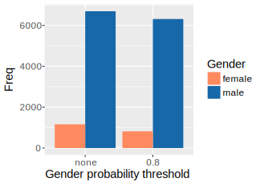

## Overview

### Current Efforts

The survey sub-team is focused on monitoring diversity and exploring obstacles, motivations, and involvement of useRs in the community.  
Diversity will be monitored via basic demographic summaries from specifically designed surveys or other community surveys (e.g. useR! 
feedback survey).

### Former Efforts

The taskforce collates data on the gender breakdown and other demographics of
contributors to the R project, particularly R Foundation supported activities. 
For many of the gender summaries the gender is predicted based on first name,
giving a rough approximation that assumes binary gender categories.

## Packages

### Maintainer Gender 2017

In [Pinto, Wiese & Dias (2018). How Do Scientists Develop Scientific Software? An External Replication](http://gustavopinto.org/lost+found/saner-rene2018.pdf), the authors surveyed CRAN maintainers that self-identified as a 
scientist. The survey was conducted starting in late November 2017 and ending in early January 2018. The respondents were contacted 
by email and asked to complete an online questionnaire, with a response rate of 24% (a total of 1,553 responses). 

 In 2017, 10.9% of package maintainers who identified as scientists were women. 

- 44.6% of respondents identify between 30 and 40 years of age at the time of the survey.

- Overwhelmingly, 80.0% of respondents identified as either having completed or are in progress of completing a doctorate degree. 

- Almost half (48.9%) of the respondents identify as being located in Europe and another 34.1% as being located in North America.

 

   

 

  

### Maintainer Gender 2016

CRAN maintainers as of March 2016 were processed with the **genderizer** 
package, which utilizes the https://genderize.io/ API to predict gender from 
first names, with an associated probability that the prediction is correct. In 
some cases genderize.io fails to make a prediction, particularly
for Asian names, so the results were supplemented by manual predictions based on
personal knowledge (with help from Chinese colleagues).

Using assignments as given, i.e. treating predictions with probability > 0.5
as correct, 14.8% of the 7854 maintainers were predicted as female. Clearly this
is a rough estimate as not all maintainers with the same name will share the 
same gender. The frequencies could be adjusted by the probabilities, but this 
would over-estimate the proportion of female maintainers as the probabilities 
are based on a general population rather than the population of programmers, 
which is known to be male-dominated. For example genderize.io assigns the name 
"Robin" as female with probability 0.59, however the proportion of females among
CRAN maintainers with the name Robin is around 10%. So a better estimate is 
obtained by focusing on names that are strongly predictive of gender, i.e. with
probability at least 0.8, giving an estimate of 11.4%.

In 2016, 11.4% of package maintainers were women. 

### Author Demographics 2010

[Mair, P., Hofmann, E., Gruber, K., Hatzinger, R., Zeleis, A. and Hornik, K. (2015) Motivation, values, and work design as drivers of participation in the R open source project for statistical computing, <em>PNAS</em>](http://www.pnas.org/content/112/48/14788.abstract) describes the feedback from 1087 R package authors. The survey was conducted in 2010. Package authors were contacted by email and asked to complete a web form, with a response rate of 27%.

In 2010, 9% of package authors were women. 

      
- The 95% confidence interval for the proportion of women package authors in 2010 is 7.1-11.0%.
- 32.5% of authors are from the USA, but they are distributed across the globe, including Indonesia, Kenya, Slovenia and Singapore.
- The average package author was almost 39 years old, 50% of authors are between 30 and 45, and the youngest was 20.

<!-- probably flexbox better but okay for now -->

## Conferences

Data is being collated on past useR! conferences, the plots below show the 
data gathered so far.

2016 saw a rise in the proportion of female attendees from 19% to 28%. 

The proportion of contributed presentations is similar to the proportion of female
attendees, showing that women are as likely to contribute and have their 
contributions accepted as their male counterparts. There was a greater increase 
in poster contributions from women than lightning or regular talks in 2016, 
which perhaps reflects a lower level of experience among the newcomers.

Plot **c** shows groups that are more heavily selected. The numbers of female 
invited speakers has increased from zero in the early years (2004-2008) through
one in later years (2009-2013) to two in recent years - this is the level that
useR! is seeking to maintain for now. The number of tutorials with a female tutor was
decreasing since 2007, but went up again to 1/3 in 2016. This is the target for 
2017. useR! does not always have panel sessions, but apart from a panel in 2014
on women in the R community, women have been poorly represented. This is 
something useR! plans to address in any future panels.

The last plot shows invited organisational roles. Data on session chairs is 
only available for a few years, but recently the proportion of women has been 
similar that of attendees. The proportion of female committee members has been 
slowly rising to parity over the history of useR! (with an unusual high in 2007 
when Di Cook, a taskforce member was a key organiser). The make-up of the local
organising committee is much more variable, partly because the size of the 
committee changes a lot according to local needs. In recent years the proportion
of women on the committee has been similar to or greater than that of attendees.
      